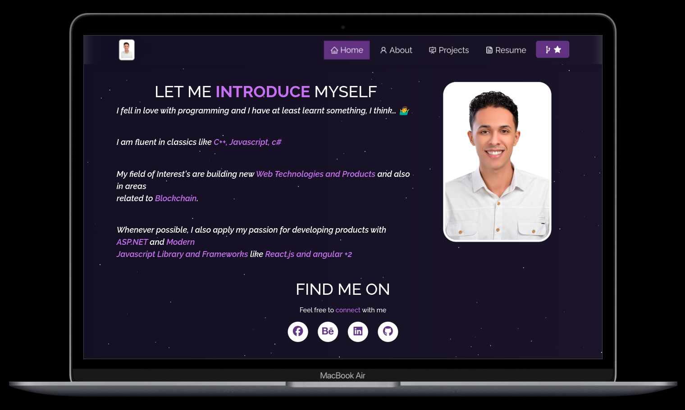

<h2 align="center">
  Portfolio Website - v1.0 
  <a href="https://marwan-portfolio-nu.vercel.app/home" target="_blank">Marwan Abubakr Portfolio</a>
</h2>

  

 

 &nbsp;
 &nbsp;

## Built With

My personal portfolio <a href="https://marwan-portfolio-nu.vercel.app/home" target="_blank">Marwan Abubakr</a> which features some of my github projects as well as my resume and technical skills. 

This project was built using these technologies.

- Angular 16
- Html
- VsCode
- Vercel

## Features

**📖 Multi-Page Layout**

**🎨 Styled with Bootstrap and Scss with easy to customize colors**

**📱 Fully Responsive**

## Getting Started

Clone down this repository. You will need `node.js` and `git` installed globally on your machine.

## 🛠 Installation and Setup Instructions

1. Installation: `npm install`

2. In the project directory, you can run: `ng s -o `

Runs the app in the development mode.\
Open [http://localhost:4200](http://localhost:4200) to view it in the browser.
The page will reload if you make edits.

## Usage Instructions

Open the project folder and Navigate to `/src/core/`.  
You will find all the components used and you can edit your information accordingly.

### Show your support

Give a ⭐ if you like this website!

